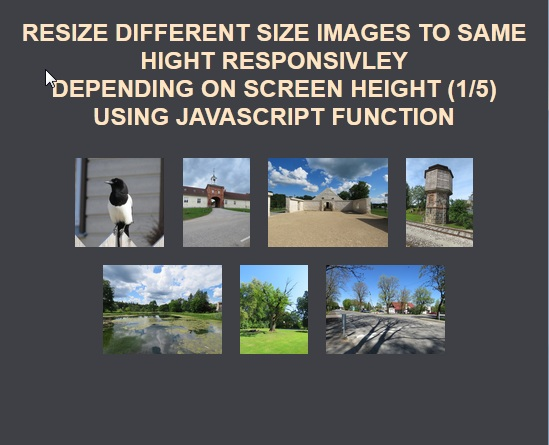

# Responsively-Sizing-Images-With-JS
To resize images depending on window view height responsively



* Function started on body onload:
```
<body onload="imgResizeFunction()">
```

* Added eventlistener for window resize:
```
window.addEventListener('resize', imgResizeFunction);
```

* Getting all images on page with 'img' tag name:
```
var img = document.getElementsByTagName('img')
```

# HAPPY CODING !!!


